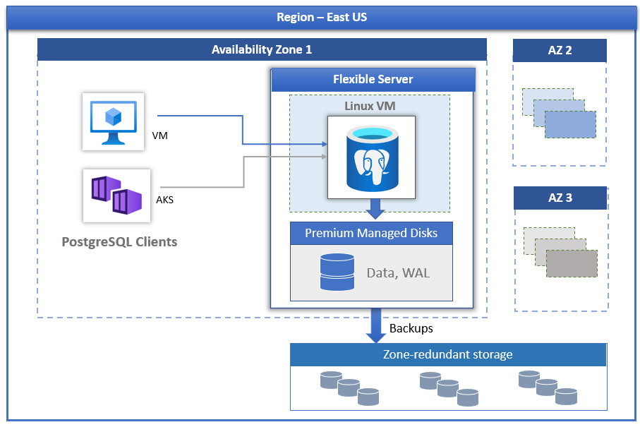

# What is Azure Database for PostgreSQL?

Azure Database for PostgreSQL is a managed database solution that provides highly available, massively scalable PostgreSQL in the cloud. The solution is made up of two tightly integrated layers: PostgreSQL, and specialized Azure services. You’re provided with all the features of the community edition of PostgreSQL [PostgreSQL open source relational database](https://www.postgresql.org/), with the security, reliability, and performance you expect from Azure.

Azure Database for PostgreSQL delivers:

- Built-in high availability.
- Data protection using automatic backups and point-in-time-restore for up to 35 days.
- Automated maintenance for underlying hardware, operating system and database engine to keep the service secure and up to date.
- Predictable performance, using inclusive pay-as-you-go pricing.
- Elastic scaling within seconds.
- Enterprise grade security and industry-leading compliance to protect sensitive data at-rest and in-motion.
- Monitoring and automation to simplify management and monitoring for large-scale deployments.
- Industry-leading support experience.

# The Azure layer

PostgreSQL in Azure has two services, Azure Database for PostgreSQL and Azure Cosmos DB for PostgreSQL.

Azure Database for PostgreSQL is available in two deployment modes, with each deployment mode allowing different levels of customization and scale.

Flexible server is suitable for production workloads that require zone resilient HA, predictable performance, maximum control, custom maintenance window, cost optimization controls and simplified developer experience. Ideal for workloads that don't need full compute capacity continuously.

# Data protection and security benefits

Data is automatically encrypted and backed up. Options such as Advanced Threat Protection make it simple to address potential threats without the need to be a security expert or manage advanced security monitoring systems.

The example of a contactless payment app having a simple and reliable way to back up your database means you can focus on developing your app. Also, Advanced Threat Protection means it will be easier for you to mitigate threats if they arise during a trial, without having to rely on expert security personnel.

# Lower administrative complexity and cost

For many businesses, the decision to transition to a cloud service is as much about offloading the complexity of administration as it is about cost. Azure helps to lower administrative costs in three key ways.

Azure automates maintenance and updates for the underlying hardware, operating system, and the database engine (minor versions).
Azure provides automated management and analytics for monitoring of large-scale deployments.
Together these capabilities can allow for significant cost savings, especially when many databases need to be supported.

## Deployment models

Azure Database for PostgreSQL powered by the PostgreSQL community edition is available in three deployment modes,
However, we will be focusing Flexible Server.

### Azure Database for PostgreSQL - Flexible Server

Azure Database for PostgreSQL Flexible Server is a fully managed database service designed to provide more granular control and flexibility over database management functions and configuration settings. In general, the service provides more flexibility and customizations based on the user requirements. The flexible server architecture allows users to opt for high availability within single availability zone and across multiple availability zones. Flexible Server provides better cost optimization controls with the ability to stop/start server and burstable compute tier, ideal for workloads that don’t need full-compute capacity continuously. The service currently supports community version of PostgreSQL 11, 12, 13 and 14, with plans to add newer versions soon. The service is generally available today in wide variety of Azure regions.

Flexible servers are best suited for

- Application developments requiring better control and customizations
- Cost optimization controls with ability to stop/start server
- Zone redundant high availability
- Managed maintenance windows

## Overview

Azure Database for PostgreSQL - Flexible Server is a fully managed database service designed to provide more granular control and flexibility over database management functions and configuration settings. In general, the service provides more flexibility and server configuration customizations based on the user requirements. The flexible server architecture allows users to collocate database engine with the client-tier for lower latency,  choose high availability within a single availability zone and across multiple availability zones. Flexible servers also provide better cost optimization controls with ability to stop/start your server and burstable compute tier that is ideal for workloads that do not need full compute capacity continuously. The service currently supports community version of [PostgreSQL 11, 12, 13, and 14](./concepts-supported-versions.md). The service is currently available in wide variety of  [Azure regions](https://azure.microsoft.com/global-infrastructure/services/).

Flexible servers are best suited for

- Application developments requiring better control and customizations.
- Zone redundant high availability
- Managed maintenance windows
  
## Architecture and high availability

The flexible server deployment model is designed to support high availability within a single availability zone and across multiple availability zones. The architecture separates compute and storage. The database engine runs on a container inside a Linux virtual machine, while data files reside on Azure storage. The storage maintains three locally redundant synchronous copies of the database files ensuring data durability.

If zone redundant high availability is configured, the service provisions and maintains a warm standby server across availability zone within the same Azure region. The data changes on the source server are synchronously replicated to the standby server to ensure zero data loss. With zone redundant high availability, once the planned or unplanned failover event is triggered, the standby server comes online immediately and is available to process incoming transactions. This allows the service resiliency from availability zone failure within an Azure region that supports multiple availability zones as shown in the picture below.

## Automated patching with managed maintenance window

The service performs automated patching of the underlying hardware, OS, and database engine. The patching includes security and software updates. For PostgreSQL engine, minor version upgrades are also included as part of the planned maintenance release. Users can configure the patching schedule to be system managed or define their custom schedule. During the maintenance schedule, the patch is applied, and server may need to be restarted as part of the patching process to complete the update. With the custom schedule, users can make their patching cycle predictable and choose a maintenance window with minimum impact to the business. In general, the service follows monthly release schedule as part of the continuous integration and release.

## Automatic backups

The flexible server service automatically creates server backups and stores them on zone redundant storage (ZRS) within the region. Backups can be used to restore your server to any point-in-time within the backup retention period. The default backup retention period is seven days. The retention can be optionally configured up to 35 days. All backups are encrypted using AES 256-bit encryption. See [Backups](./concepts-backup-restore.md) for more details.

## Adjust performance and scale within seconds

The flexible server service is available in three compute tiers: Burstable, General Purpose, and Memory Optimized. The Burstable tier is best suited for low-cost development and low concurrency workloads that do not need full compute capacity continuously. The General Purpose and Memory Optimized are better suited for production workloads requiring high concurrency, scale, and predictable performance. You can build your first application on a small database for a few dollars a month, and then seamlessly adjust the scale to meet the needs of your solution.

## Stop/Start server to lower TCO

The flexible server service allows you to stop and start server on-demand to lower your TCO. The compute tier billing is stopped immediately when the server is stopped. This can allow you to have significant cost savings during development, testing and for time-bound predictable production workloads. The server remains in the stopped state for seven days unless restarted sooner.

## Enterprise grade security

The flexible server service uses the FIPS 140-2 validated cryptographic module for storage encryption of data at-rest. Data, including backups, and temporary files created while running queries are encrypted. The service uses the AES 256-bit cipher included in Azure storage encryption, and the keys can be system managed (default). The service encrypts data in-motion with transport layer security (SSL/TLS) enforced by default. The service enforces and supports TLS versions 1.2 only.

Flexible servers allow full private access to the servers using Azure virtual network (VNet integration). Servers in Azure virtual network can only be reached and connected through private IP addresses. With VNet integration, public access is denied and servers cannot be reached using public endpoints.

## Monitoring and alerting

The flexible server service is equipped with built-in performance monitoring and alerting features. All Azure metrics have a one-minute frequency, and each metric provides 30 days of history. You can configure alerts on the metrics. The service exposes host server metrics to monitor resources utilization and allows configuring slow query logs. Using these tools, you can quickly optimize your workloads, and configure your server for best performance.

## Built-in PgBouncer

The flexible server comes with a [built-in PgBouncer](concepts-pgbouncer.md), a connection pooler. You can optionally enable it and connect your applications to your database server via PgBouncer using the same host name and the port 6432.

## Next steps

Create Flexible Server.

- [Create Flexible Server](./CreateAzurePostGresql.md)

