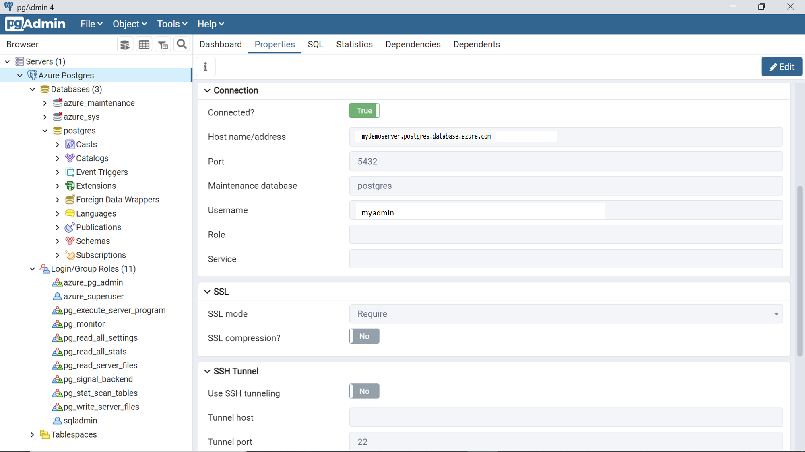

[< Previous Module](./ConnectPGUsingpsql.md) - **[Home](../../README.md)** - [Next Module >](../module02/how-to-migrate-using-dump-and-restore.md)

# Module 03 - Connecting to Azure Database for PostgreSQL with pgAdmin
In this excercise, we will show how to connect to instances of Azure Database for PostgreSQL servers using the pgAdmin tool installed locally on a user’s workstation.

# Introduction

Every type of database has a set of data tools that helps management and operations on the database instances. The most popular management tool to operate on the Azure database for PostgreSQL is pgAdmin. Let’s go ahead and see how to connect to instances of Azure Database for PostgreSQL using the pgAdmin tool.

We will connect to an instance of Azure Database for PostgreSQL using pgAdmin, so the first step of this exercise is installing pgAdmin on a local workstation. The latest version of this tool is pgAdmin 4. This tool can be freely downloaded on the local machine from [here](https://www.pgadmin.org/download/). As shown below, one can select the version of the tool based on the Operating System or platform on which the tool is expected to be installed. We would be using the version of the tool that will be installed on a Windows operating system.

 

After pgAdmin 4 is installed, we will connect to the Azure Database for the Postgres instance that we created in the earlier excercise. Once pgAdmin is opened for the very first time, it will prompt to configure a master password. After setting up this password, you would be able to access this tool.

 

Click on the Add New Server option from the quick links as shown above, which would bring up a dialog box as shown below. To access the Azure Database for the Postgres instance, we need to register the instance first. In the General tab, we need to provide a name for the server, and we can make it part of any logical group, which allows administrators to administer multiple database instances as a group.

 

In the Connection tab, we need to provide the hostname or address. This is the server name of the instance that we created earlier, as shown below. The default port of Azure Database for PostgreSQL server is 5432. The default maintenance database is Postgres. We will fill up these details as shown below. Provide the administrator credentials that you would have configured while creating the database instance.

 

Open the SSL tab and you would find that the SSL mode is set to a value of “Prefer”, which means that it is not mandated. This would mean that one can open connections from a local workstation to the Azure Database for PostgreSQL instance hosted on Azure cloud, which are not encrypted by SSL, which are not secured and hence not recommended. Change the value of SSL mode to “Require”. Typically, in production environments, one may also have certificates set up to establish the unique authenticity of the database. Once done, click on the Save button.

 

Once we click on the Save button, pgAdmin 4 would immediately attempt to connect to the database instance and it would fail with an error as shown below. The reason is that we did not specify the username in the format expected by pgAdmin 4, which is username@hostname format. Click Ok and navigate to the Connection tab.

 

Change the format of the username as shown below. Sqladmin is the username in our case and the portion after “@” is the hostname, which can be easily found from the dashboard page of the database instance.

 

After changing the database username format, click on the Save button, and that would re-initiate connection to the instance. The connection would again fail with an error, as shown below. The reason is that we have not configured the firewall settings of the Azure Database for the Postgres instance to allow incoming connections from the workstation on which pgAdmin 4 is installed.

 

Navigate to the dashboard of the database instance and click on the Connection Security menu item, and you should be able to see a screen as shown below. Click on the Add current client IP address to add the IP of the workstation from which we are trying to initiate a connection. Once the IP has been added, click on the Save button to save the configuration so that it can come into effect.

 

Once the configuration has been saved, switch back to pgAdmin 4 and attempt the save the server configuration. This time the server should get added to the pgAdmin console and the connection should be successful. Once connected, the server would get listed on the browser pane as shown below.

By default, the database to which pgAdmin connects is the Postgres database. The dashboard would instantly start showing the activity on the server in the different charts as shown above. On the server activity pane at the bottom, it would list all the connections from various client tools. Click on the properties tab and select the server name as shown below. It would show that we are connected to the database instance. It would also list all the configuration details that are in effect to connect to the Azure Database for PostgreSQL instance. If you carefully analyze the properties, you would also find that SSL mode is set to Require, which means our connection is securely encrypted with SSL.

## Next steps
[Continue >](../module02/how-to-migrate-using-dump-and-restore.md)

