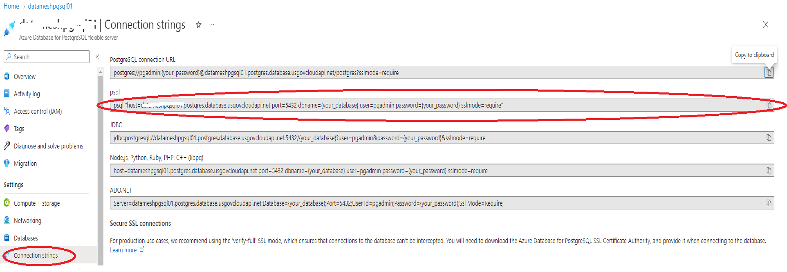
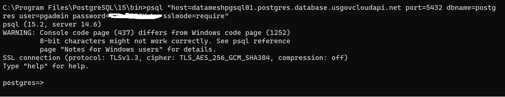
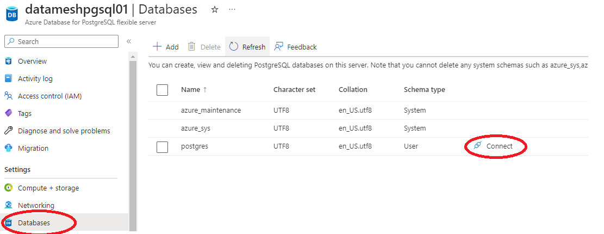

[< Previous Module](../module01/CreateAzurePostGresql.md) - **[Home](../../README.md)** - [Next Module >](./ConnectPGSql.md)

# Module 02a - Connecting to Azure Database for PostgreSQL using psql

There are a number of applications you can use to connect to your Azure Database for PostgreSQL server. If your client computer has PostgreSQL installed, you can use a local instance of [psql](https://www.postgresql.org/docs/current/static/app-psql.html) to connect to an Azure PostgreSQL server. Let's now use the psql command-line utility to connect to the Azure PostgreSQL server.

Please Note: If you prefer to use PgAdmin to connect to your PostgreSQL instance then move on to the next section. 

1. Run the following psql command to connect to an Azure Database for PostgreSQL server. You can get the connection string from the Portal as well.



   ```bash
   psql --host=<servername> --port=<port> --username=<user> --dbname=<dbname>
   ```

   For example, the following command connects to the default database called **postgres** on your PostgreSQL server **mydemoserver.postgres.database.azure.com** using access credentials. Enter the `<server_admin_password>` you chose when prompted for password.
  
   ```bash
   psql --host=mydemoserver-pg.postgres.database.azure.com --port=5432 --username=myadmin --dbname=postgres
   ```

   After you connect, the psql utility displays a postgres prompt where you type sql commands. In the initial connection output, a warning may appear because the psql you're using might be a different version than the Azure Database for PostgreSQL server version.

   Example psql output:



   > Please Note:
   > If the firewall is not configured to allow the IP address of your client, the following error occurs:
   >
   > "psql: FATAL:  no pg_hba.conf entry for host `<IP address>`, user "myadmin", database "postgres", SSL on FATAL: SSL connection is required. Specify SSL options and retry.
   >
   > Confirm your client's IP is allowed in the firewall rules step above.

2. Create a blank database called "dvdrental" at the prompt by typing the following command:

    ```bash
    CREATE DATABASE dvdrental;
    ```

3. At the prompt, execute the following command to switch connections to the newly created database **dvdrental**:

    ```bash
    \c dvdrental
    ```

4. Type  `\q`, and then select the Enter key to quit psql.

You connected to the Azure Database for PostgreSQL server via psql, and you created a blank user database.

You can also connect using psql utility from Portal. By clicking Database from the blade and click Connect.



# Connecting to Azure Database for PostgreSQL with pgAdmin

We will connect to an instance of Azure Database for PostgreSQL using pgAdmin

## Next steps

[Continue >](./ConnectPGSql.md)


