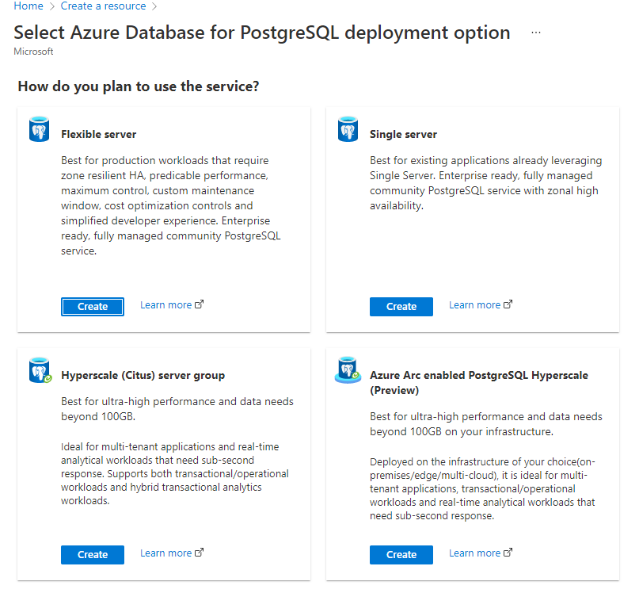
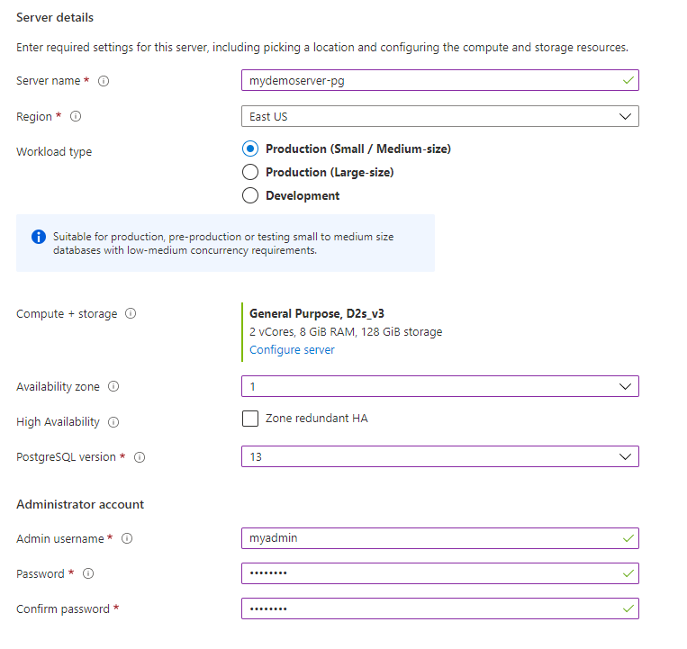
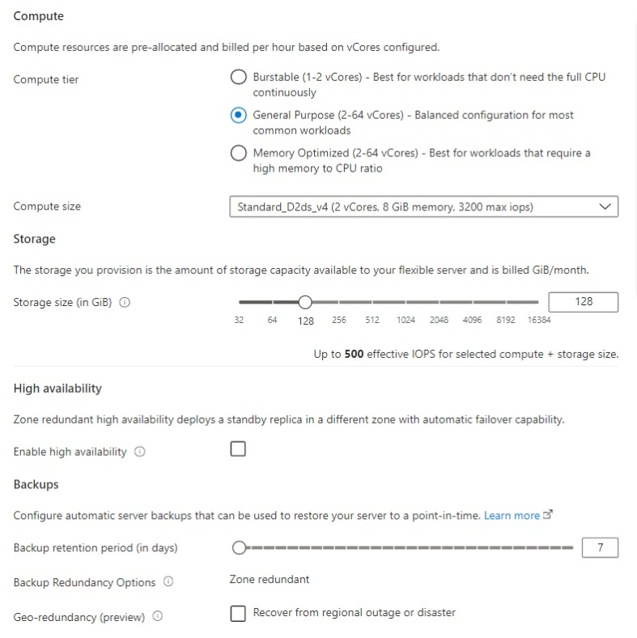
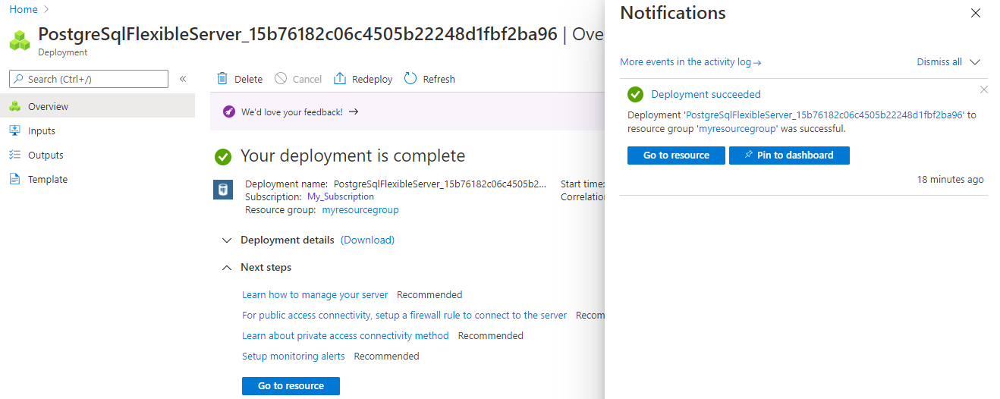

# Module 01 - Create an Azure Database for PostgreSQL - Flexible Server in the Azure portal

[< Previous Module](../../README.md) - **[Home](../../README.md)** - [Next Module >](../modules/module02.md)

Azure Database for PostgreSQL is a managed service that you use to run, manage, and scale highly available PostgreSQL databases in the cloud. This Quickstart shows you how to create an Azure Database for PostgreSQL - Flexible Server in about five minutes using the Azure portal.

If you don't have an Azure subscription, create a [free Azure account](https://azure.microsoft.com/free/) before you begin.

## Sign in to the Azure portal

Open your web browser and go to the [portal](https://portal.azure.com/). Enter your credentials to sign in to the portal. The default view is your service dashboard.

## Create an Azure Database for PostgreSQL server

An Azure Database for PostgreSQL server is created with a configured set of [compute and storage resources](./concepts-compute-storage.md). The server is created within an [Azure resource group](../../azure-resource-manager/management/overview.md).

To create an Azure Database for PostgreSQL server, take the following steps:

1. Select **Create a resource** (+) in the upper-left corner of the portal.

2. Select **Databases** > **Azure Database for PostgreSQL**.

    

3. Select the **Flexible server** deployment option.

     

4. Fill out the **Basics** form with the following information:

     

    Setting|Suggested Value|Description
    ---|---|---
    Subscription|Your subscription name|The  Azure subscription that you want to use for your server. If you have multiple subscriptions, choose the subscription in which you'd like to be billed for the resource.
    Resource group|*myresourcegroup*| A new resource group name or an existing one from your subscription.
    Workload type|Default SKU selection|You can choose from Development (Burstable SKU), Production small/medium (General purpose SKU), or Production large (Memory optimized SKU). You can further customize the SKU and storage by clicking *Configure server* link.
    Availability zone|Your preferred AZ|You can choose in which availability zone you want your server to be deployed. This is useful to co-locate with your application. If you choose *No preference*, a default AZ is selected for you.
    High availability|Enable it zone-redundant deployment| By selecting this option, a standby server with the same configuration as your primary will be automatically provisioned in a different availability zone in the same region. Note: You can enable or disable high availability post server create as well.
    Server name |*mydemoserver-pg*|A unique name that identifies your Azure Database for PostgreSQL server. The domain name *postgres.database.azure.com* is appended to the server name you provide. The server can contain only lowercase letters, numbers, and the hyphen (-) character. It must contain at least 3 through 63 characters.
    Admin username |*myadmin*| Your own login account to use when you connect to the server. The admin login name can't be **azure_superuser**, **azure_pg_admin**, **admin**, **administrator**, **root**, **guest**, or **public**. It can't start with **pg_**.
    Password |Your password| A new password for the server admin account. It must contain between 8 and 128 characters. Your password must contain characters from three of the following categories: English uppercase letters, English lowercase letters, numbers (0 through 9), and non-alphanumeric characters (!, $, #, %, etc.).
    Location|The region closest to your users| The location that is closest to your users.
    Version|The latest major version| The latest PostgreSQL major version, unless you have specific requirements otherwise.
    Compute + storage | **General Purpose**, **4 vCores**, **512 GB**, **7 days** | The compute, storage, and backup configurations for your new server. Select **Configure server**. *General Purpose*, *4 vCores*, *512 GB*, and *7 days* are the default values for **Compute tier**, **vCore**, **Storage**, and **Backup Retention Period**.  You can leave those sliders as is or adjust them.     To configure your server with **Geo-redundant Backup** to protect from region-level failures, you can check the box ON. Note that the Geo-redundant backup can be configured only at the time of server creation. To save this pricing tier selection, select **OK**. The next screenshot captures these selections.

 
    
5. Configure Networking options
6. 
    On the **Networking** tab, you can choose how your server is reachable. Azure Database for PostgreSQL Flexible Server provides two ways to connect to your server:
   - Public access (allowed IP addresses)
   - Private access (VNet Integration)

    When you use public access, access to your server is limited to allowed IP addresses that you add to a firewall rule. This method prevents external applications and tools from     connecting to the server and any databases on the server, unless you create a rule to open the firewall for a specific IP address or range. When you use private access (VNet       Integration), access to your server is limited to your virtual network. [Learn more about connectivity methods in the concepts article.](./concepts-networking.md)

     In this quickstart, you'll learn how to enable public access to connect to the server. On the **Networking tab**, for **Connectivity method** select **Public access**. For configuring **Firewall rules**, select **Add current client IP address**.

    > [!NOTE]
    > You can't change the connectivity method after you create the server. For example, if you select **Public access (allowed IP addresses)** when you create the server, you can't change to **Private access (VNet Integration)** after the server is created. We highly recommend that you create your server with private access to help secure access to your server via VNet Integration. [Learn more about private access in the concepts article.](./concepts-networking.md)

    

6. Select **Review + create** to review your selections. Select **Create** to provision the server. This operation may take a few minutes.

7. On the toolbar, select the **Notifications** icon (a bell) to monitor the deployment process. Once the deployment is done, you can select **Pin to dashboard**, which creates a tile for this server on your Azure portal dashboard as a shortcut to the server's **Overview** page. Selecting **Go to resource** opens the server's **Overview** page.

      

   By default, a **postgres** database is created under your server. The [postgres](https://www.postgresql.org/docs/current/static/app-initdb.html) database is a default database that's meant for use by users, utilities, and third-party applications. (The other default database is **azure_maintenance**. Its function is to separate the managed service processes from user actions. You cannot access this database.)

    > Please note:
    > Connections to your Azure Database for PostgreSQL server communicate over port 5432. When you try to connect from within a corporate network, outbound traffic over port 5432 might not be allowed by your network's firewall. If so, you can't connect to your server unless your IT department opens port 5432.
    >

## Get the connection information

When you create your Azure Database for PostgreSQL server, a default database named **postgres** is created. To connect to your database server, you need your full server name and admin login credentials. You might have noted those values earlier in the Quickstart article. If you didn't, you can easily find the server name and login information on the server **Overview** page in the portal.

Open your server's **Overview** page. Make a note of the **Server name** and the **Server admin login name**. Hover your cursor over each field, and the copy symbol appears to the right of the text. Select the copy symbol as needed to copy the values.

 

## Next steps

[Continue >](modules/module01/ConnectPGUsingpsql.md)

Connect Flexible Server.
- [Connect Flexible Server Using psql](./ConnectPGUsingpsql.md)
- [Connect Flexible Server Using PgAdmin](./ConnectPGSql.md)
