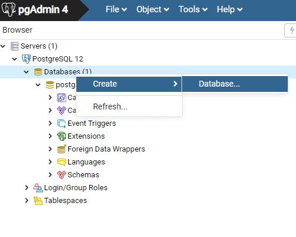
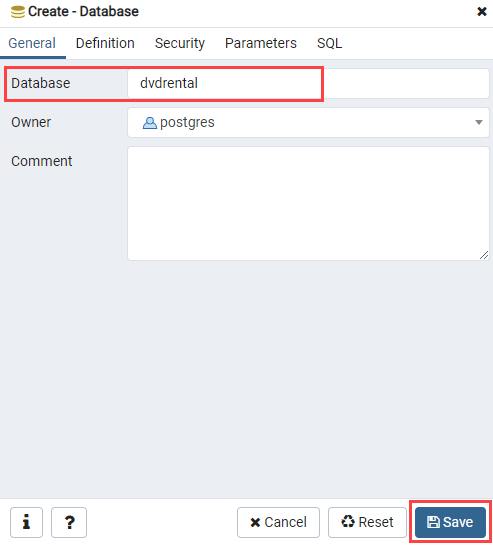
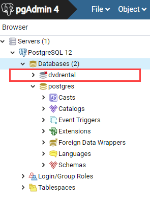
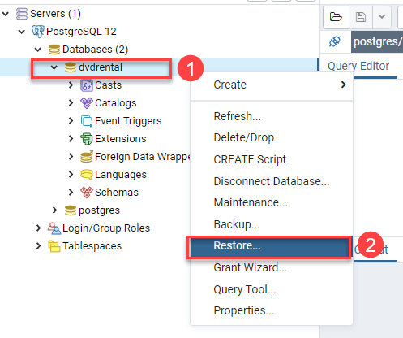
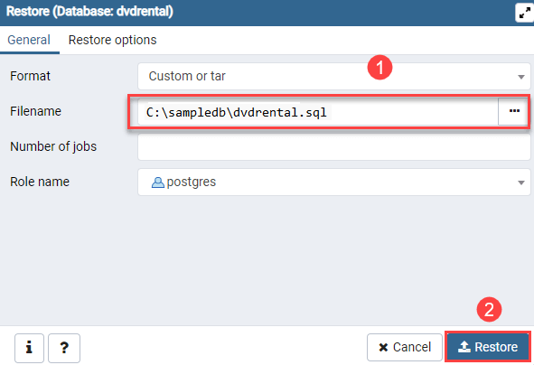
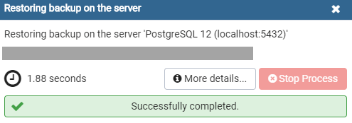

# Migrate your PostgreSQL database by using dump and restore


You can use [pg_dump](https://www.postgresql.org/docs/current/static/app-pgdump.html) to extract a PostgreSQL database into a dump file. Then use [pg_restore](https://www.postgresql.org/docs/current/static/app-pgrestore.html) to restore the PostgreSQL database from an archive file created by `pg_dump`.

## Prerequisites

To step through this how-to guide, you need:
- An [Azure Database for PostgreSQL server](../single-server/quickstart-create-server-database-portal.md), including firewall rules to allow access.
- [pg_dump](https://www.postgresql.org/docs/current/static/app-pgdump.html) and [pg_restore](https://www.postgresql.org/docs/current/static/app-pgrestore.html) command-line utilities installed.

## Create a dump file that contains the data to be loaded

To back up an existing PostgreSQL database on-premises or in a VM, run the following command:

```bash
pg_dump -Fc -v --host=<host> --username=<name> --dbname=<database name> -f <database>.dump
```
For example, if you have a local server and a database called **testdb** in it, run:

```bash
pg_dump -Fc -v --host=localhost --username=masterlogin --dbname=testdb -f testdb.dump
```

## Restore the data into the target database

Download the PostgreSQL DVD Rental sample database from dbdump folder. The database file is in zip format (dvdrental.zip) and you need to extract it to dvdrental.tar before restoring it inot the PostgreSQL database intance.

## Restore the DVD Rental database using the psql

First launch the psql tool.

Execute the following CREATE DATABASE statement to create a new database called dvdrental.

CREATE DATABASE dvdrental;


After you've created the target database, you can use the `pg_restore` command and the  `--dbname` parameter to restore the data into the target database from the dump file.

```bash
pg_restore -v --no-owner --host=<server name> --port=<port> --username=<user-name> --dbname=<target database name> C:\sampledb\dvdrental.tar
```

Including the `--no-owner` parameter causes all objects created during the restore to be owned by the user specified with `--username`. For more information, see the [PostgreSQL documentation](https://www.postgresql.org/docs/9.6/static/app-pgrestore.html).

> Please Note:
> On Azure Database for PostgreSQL servers, TLS/SSL connections are on by default. If your PostgreSQL server requires TLS/SSL connections, but doesn't have them, set an environment variable `PGSSLMODE=require` so that the pg_restore tool connects with TLS. Without TLS, the error might read: "FATAL: SSL connection is required. Please specify SSL options and retry." In the Windows command line, run the command `SET PGSSLMODE=require` before running the `pg_restore` command. In Linux or Bash, run the command `export PGSSLMODE=require` before running the `pg_restore` command. 
>

In this example, restore the data from the dump file **dvdrental.tar** into the database **dvdrental**, on target server **mydemoserver.postgres.database.azure.com**.


Here's an example for how to use this `pg_restore` for Flexible Server:

```bash
pg_restore -v --no-owner --host=mydemoserver.postgres.database.azure.com --port=5432 --username=mylogin --dbname=mypgsqldb C:\sampledb\dvdrental.tar
```
## Restore the DVD Rental database using the pgAdmin

The step by step directions on how to use the pgAdmin tool to restore the sample database from the database file:

First, launch the pgAdmin tool and connect to the PostgreSQL server.

Second, right click the Databases and select the Create > Database… menu option:


 

Next, enter the database name dvdrental and click the Save button:

 

You’ll see the new empty database created under the Databases node:

 

Next, right-click on the dvdrental database and choose Restore… menu item to restore the database from the downloaded database file:

 

Next, enter the path to the sample database file e.g., c:\sampledb\dvdrental.tar and click the Restore button:

 

Next, the restore process will complete in few seconds and shows the following dialog once it completes:



Finally, open the dvdrental database from object browser panel, you will find tables in the public schema and other database objects as shown in the following image:


## Optimize the migration process

One way to migrate your existing PostgreSQL database to Azure Database for PostgreSQL is to back up the database on the source and restore it in Azure. To minimize the time required to complete the migration, consider using the following parameters with the backup and restore commands.

> Please Note:
> For detailed syntax information, see [pg_dump](https://www.postgresql.org/docs/current/static/app-pgdump.html) and [pg_restore](https://www.postgresql.org/docs/current/static/app-pgrestore.html).
>

### For the backup

Take the backup with the `-Fc` switch, so that you can perform the restore in parallel to speed it up. For example:

```bash
pg_dump -h my-source-server-name -U source-server-username -Fc -d source-databasename -f Z:\Data\Backups\dvdrental.dump
```

### For the restore

- Move the backup file to an Azure VM in the same region as the Azure Database for PostgreSQL server you are migrating to. Perform the `pg_restore` from that VM to reduce network latency. Create the VM with [accelerated networking](../../virtual-network/create-vm-accelerated-networking-powershell.md) enabled.

- Open the dump file to verify that the create index statements are after the insert of the data. If it isn't the case, move the create index statements after the data is inserted. This should already be done by default, but it's a good idea to confirm.

- Restore with the `-j N` switch (where `N` represents the number) to parallelize the restore. The number you specify is the number of cores on the target server. You can also set to twice the number of cores of the target server to see the impact.

    Here's an example for how to use this `pg_restore` for Single Server:

    ```bash
     pg_restore -h my-target-server.postgres.database.azure.com -U azure-postgres-username@my-target-server -j 4 -d my-target-databasename Z:\Data\Backups\dvdrental.dump
    ```

    Here's an example for how to use this `pg_restore` for Flexible Server:

    ```bash
     pg_restore -h my-target-server.postgres.database.azure.com -U azure-postgres-username -j 4 -d my-target-databasename Z:\Data\Backups\dvdrental.dump
    ```

- You can also edit the dump file by adding the command `set synchronous_commit = off;` at the beginning, and the command `set synchronous_commit = on;` at the end. Not turning it on at the end, before the apps change the data, might result in subsequent loss of data.

- On the target Azure Database for PostgreSQL server, consider doing the following before the restore:
    
  - Turn off query performance tracking. These statistics aren't needed during the migration. You can do this by setting `pg_stat_statements.track`, `pg_qs.query_capture_mode`, and `pgms_wait_sampling.query_capture_mode` to `NONE`.

  - Use a high compute and high memory SKU, like 32 vCore Memory Optimized, to speed up the migration. You can easily scale back down to your preferred SKU after the restore is complete. The higher the SKU, the more parallelism you can achieve by increasing the corresponding `-j` parameter in the `pg_restore` command.

  - More IOPS on the target server might improve the restore performance. You can provision more IOPS by increasing the server's storage size. This setting isn't reversible, but consider whether a higher IOPS would benefit your actual workload in the future.

Remember to test and validate these commands in a test environment before you use them in production.

## Next steps

[Migrate your PostgreSQL database using export and import](./how-to-migrate-using-export-and-import.md).

