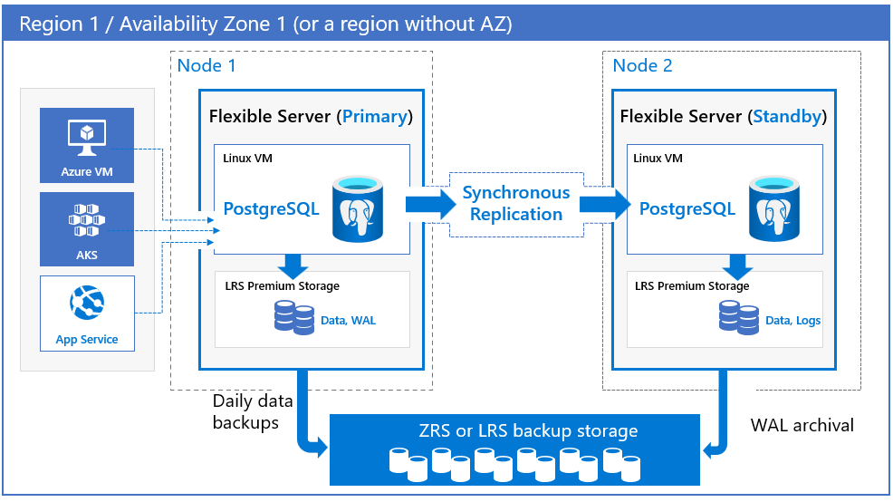

# High availability concepts in Azure Database for PostgreSQL - Flexible Server

Azure Database for PostgreSQL - Flexible Server offers high availability configurations with automatic failover capabilities. The high availability solution is designed to ensure that committed data is never lost because of failures and that the database won't be a single point of failure in your software architecture. When high availability is configured, flexible server automatically provisions and manages a standby replica. Write-ahead-logs (WAL) is streamed to the replica in  **synchronous** mode using PostgreSQL streaming replication. There are two high availability architectural models: 

* **Zone-redundant HA**: This option provides a complete isolation and redundancy of infrastructure across multiple availability zones within a region. It provides the highest level of availability, but it requires you to configure application redundancy across zones. Zone-redundant HA is preferred when you want protection from availability zone level failures and when latency across the availability zone is acceptable.  Zone-redundant HA is available in a [subset of Azure regions](./overview.md#azure-regions) where the region supports multiple availability zones. Uptime [SLA of 99.99%](https://azure.microsoft.com/support/legal/sla/postgresql) is offered in this configuration.

* **Same-zone HA**: This option is preferred for infrastructure redundancy with lower network latency because the primary and standby servers will be in the same availability zone. It provides high availability without the need to configure application redundancy across zones. Same-zone HA is preferred when you want to achieve the highest level of availability within a single availability zone with the lowest network latency. Same-zone HA is available in all Azure regions where you can deploy Flexible Server.  Uptime [SLA of 99.95%](https://azure.microsoft.com/support/legal/sla/postgresql) offered in this configuration. 

High availability configuration enables automatic failover capability with zero data loss during planned events such as user-initiated scale compute operation, and also during unplanned events such as underlying hardware and software faults, network failures, and availability zone failures. 

Please Note Both these HA deployment models architecturally behave the same. Various discussions in the following sections are applicable to both unless called out otherwise. 

## High availability architecture

Azure Database for PostgreSQL Flexible server supports two high availability deployment models. One is zone-redundant HA and the other is same-zone HA. In both deployment models, when the application performs writes or commits, using PostgreSQL streaming replication, transaction logs (write-ahead logs a.k.a WAL) are written to the local disk and also replicated in *synchronous* mode to the standby replica. Once the logs are persisted on the standby replica, the application is acknowledged of the writes or commits. The standby server will be in recovery mode which keeps applying the logs, but the primary server doesn't wait for the apply to complete at the standby server.

### Zone-redundant high availability

This high availability deployment enables Flexible server to be highly available across availability zones. You can choose the region, availability zones for the primary and standby servers. The standby replica server is provisioned in the chosen availability zone in the same region with similar compute, storage, and network configuration as the primary server. Data files and transaction log files (write-ahead logs a.k.a WAL) are stored on locally redundant storage (LRS) within each availability zone, which automatically stores **three** data copies. This provides physical isolation of the entire stack between primary and standby servers. 

Please Note Not all regions support availability zone to deploy zone-redundant high availability.

Automatic backups are performed periodically from the primary database server, while the transaction logs are continuously archived to the backup storage from the standby replica. Backup data is stored on zone-redundant storage.

### Same-zone high availability

This model of high availability deployment enables Flexible server to be highly available within the same availability zone. This is supported in all regions, including regions that don't support availability zones. You can choose the region and the availability zone to deploy your primary database server. A standby replica server is **automatically** provisioned and managed in the **same** availability zone in the same region with similar compute, storage, and network configuration as the primary server. Data files and transaction log files (write-ahead logs a.k.a WAL) are stored on locally redundant storage, which automatically stores as **three** data copies each for primary and standby. This provides physical isolation of the entire stack between primary and standby servers within the same availability zone. 

Automatic backups are performed periodically from the primary database server, while the transaction logs are continuously archived to the backup storage from the standby replica. If the region supports availability zones, then backup data is stored on zone-redundant storage (ZRS). In regions that doesn't support availability zones, backup data is stored on local redundant storage (LRS).   

[< Previous Module](../module03/concepts-business-continuity.md)

