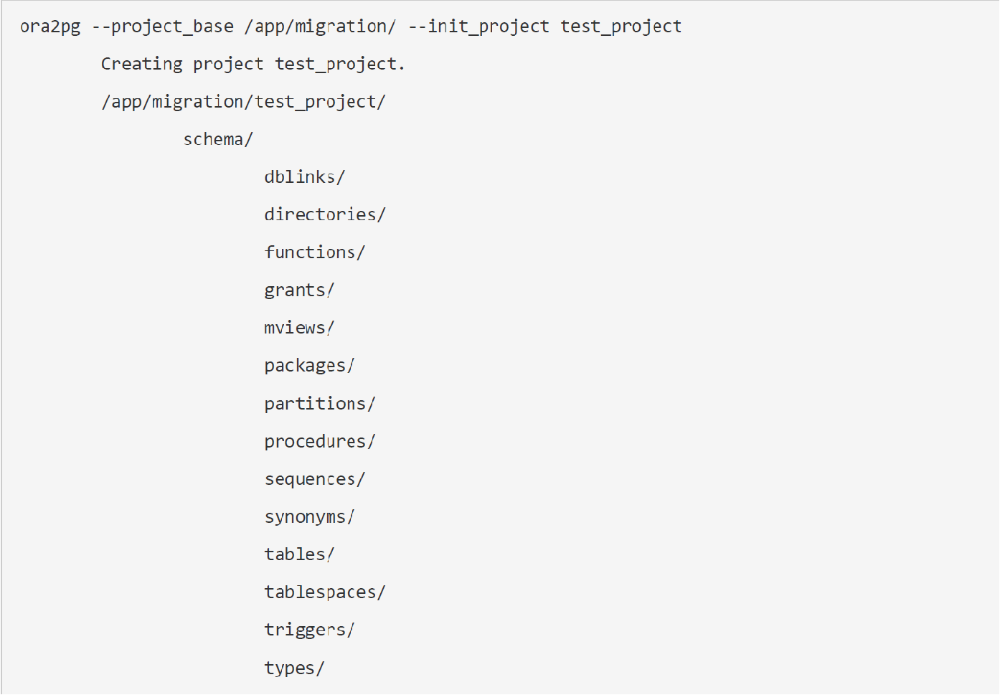
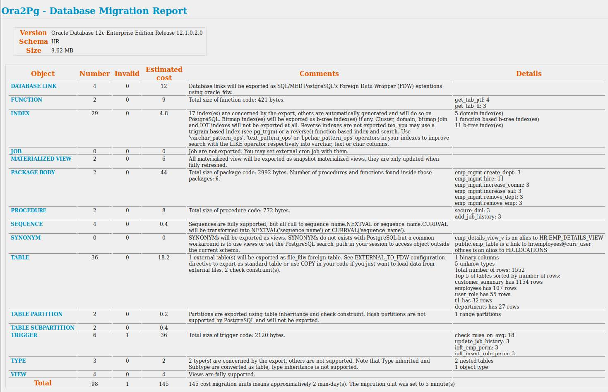

[< Previous Module](../module03/concepts-backup-restore.md) - **[Home](../../README.md)** - [Next Module >](../module07/optional.md)

# Module 06 - What is Ora2PG

Ora2Pg is a free tool used to migrate an Oracle database to a PostgreSQL compatible schema. It connects your Oracle database, scans it automatically and extracts its structure or data, then generates SQL scripts that you can load into your PostgreSQL database.

## What Ora2PG can do

* Automatic Oracle database discovery
* Automatic creation of migration projects
* Oracle database migration cost assessment
* Automatic database schema export
* Full and automatic data export
* Automatic conversion of PL/SQL to PLPGSQL
* Oracle Spatial to PostGis export

## Automatic Discovery

* Set the Oracle connection DSN
    - ora2pg -u system -w manager -t SHOW_VERSION --source
    « dbi:Oracle:host=localhost;sid=mydb »
* Set the configuration file /etc/ora2pg/ora2pg.conf
    - ORACLE_DSN dbi:Oracle:host=localhost;sid=mydb
    - ORACLE_USER system
    - ORACLE_PWD manager
* Look for schema to export and set it into configuration file:
    - ora2pg -c /etc/ora2pg/ora2pg.conf -t SHOW_SCHEMA
    - SCHEMA HR
* Lookup database tables and columns:
    - ora2pg -c /etc/ora2pg/ora2pg.conf -t SHOW_TABLE
    - ora2pg -c /etc/ora2pg/ora2pg.conf -t SHOW_COLUMN

## Create a Migration project

ora2pg --project_base /app/migration/ --init_project test_project

## Migration Assessment

* What database might be migrated first ?
    - Choose the smallest with few PL/SQL to learn Ora2Pg usage
    - Then choose the most representative, you need to forge your experience
* But how much human-days this work will cost me?
    - Use Ora2Pg migration assessment report
    
ora2pg -c /etc/ora2pg.conf -t SHOW_REPORT --estimate_cost --dump_as_html > report.html

## Sample assessment report

## Schema Migration

* Almost everything is exported :
 - table, constraint, index, sequence, trigger, view, tablespace, grant, type, partition
 - procedure, function, package, synonym, database link, materialized view, ...
* Some are not exported and need adaptation :
 - IOT / Cluster indexes can be replaced by « CLUSTER table_name USING index_name ».
 - Bitmap indexes are internally build by PostgreSQL when needed.
 - Reverse indexes can be replaced by a trigram-based index (see pg_trgm) or a reverse() function based index and search.
 - Type inheritance and type with member method are not supported
 - Global indexes over partitions are not supported
 - Global Temporary Table does not exists
 - Virtual Columns does not exists, use view instead
 - Compound triggers are not supported

## Data Migration

* Can you migrate Big data ?
 - Tera bytes of data and billions of rows in tables takes hours
 - Purge or archive unused or rarely used data
 - Import live data first, open to production then import remaining data

Simple table (only columns with numbers) : +1 millions rows / second
* Complex table (lot of CLOB and/or BLOB) : 100 rows / second
* Always use COPY data export mode, INSERT is too slow

## Next steps

-   Learn about [Ora2PG Installation on Windows](./Ora2PGInstallWin.md)

-   Learn about [Ora2PG Installation on Linux](./Ora2PGInstallLinux.md)

## Skip to Home
**[Home](../../README.md)**

