[< Previous Module](../module03/concepts-backup-restore.md) - **[Home](../../README.md)** - [Next Module >](../module07/optional.md)

# Module 06b - Ora2PG Installation on Linux
This document will provide step by step guidance of Ora2PG installation on a standalone machine. In our case, we will call this machine as jumpbox where other migration related software’s can be installed along with Ora2PG.
Before spinning this jumpbox up, we need to download below items to local machine as a prerequisite.

* [Installora2pg.sh](./script/installora2pg.sh)
* instantclient-basic-linux.x64-19.3.0.0.0dbru.zip [latest file](https://www.oracle.com/database/technologies/instant-client/linux-x86-64-downloads.html)
* instantclient-sdk-linux.x64-19.3.0.0.0dbru.zip [latest file](https://www.oracle.com/database/technologies/instant-client/linux-x86-64-downloads.html)
* [MobaXterm](https://mobaxterm.mobatek.net/download.html)

Next create a VM preferably in the same vnet where the Oracle DB is resided. Below please find a screenshot of Linux VM creation example.

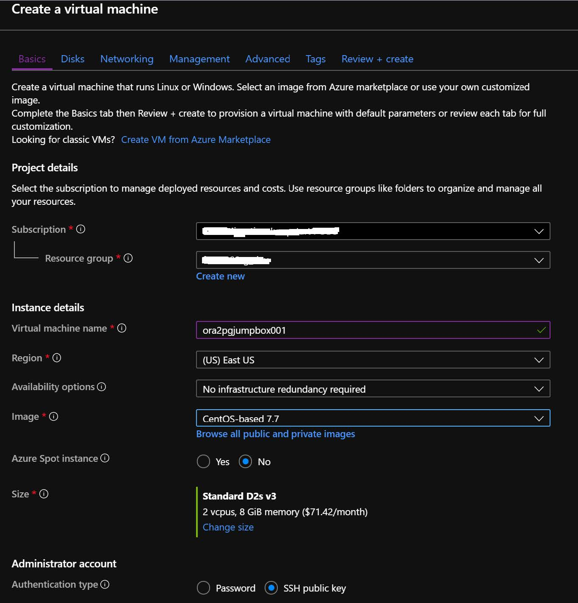

After creating the VM, please login to the machine using MobaXterm or any other SSH client.
Next drag and drop those 3 items listed above in the prerequisite from local machine to this newly created jumpbox. Files will be saved in the user home directory.

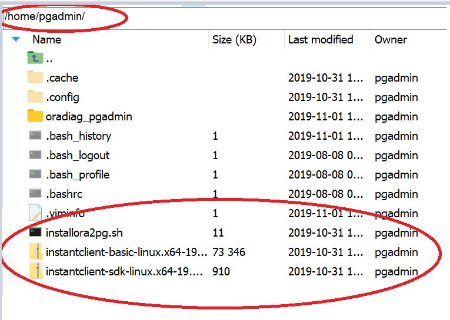

After copying the files, please go to root using below command.

Enter password for the user, in our case pgadmin is the user we have supplied while spinning up the jumpbox.

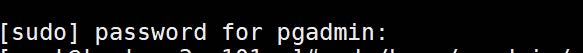

Next go to pgadmin home directory using cd command.

Next run ls -l command to verify that files have been copied successfully

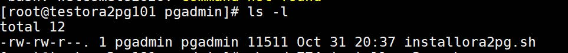

Next step would be to change the permission of those 3 files using below command.

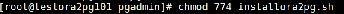

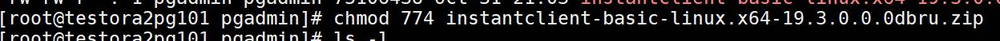

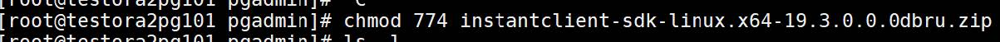

Verify change of permission using ls -l command.

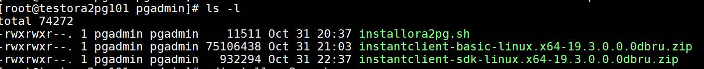

Next step would be to kick off the installation process of Ora2PG using installora2pg shell script.

After finishing the script, if it installs without any error below message will be observed.

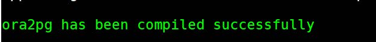

Next we need to export the LD_LIBRARY_PATH using export command. Please ensure use the correct oracle_instant_client_version_number.

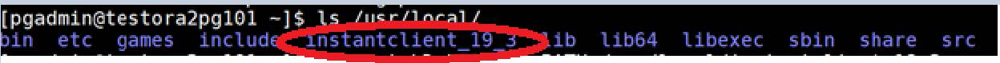

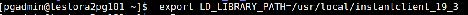

Next we need to create configuration file by using cd command.

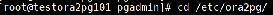

There is a sample configuration in the ora2pg folder and create another file called ora2pg.conf using copy command.

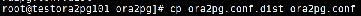

Next we need to update the configuration file by setting up correct ORACLE_DSN entry using vi.

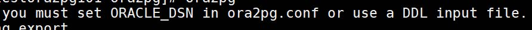

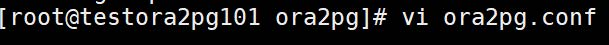

Sample ORACLE_DSN entry.

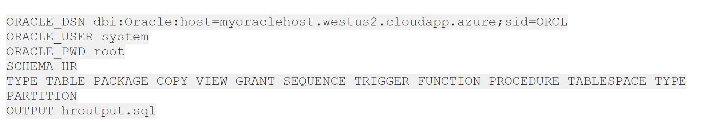

Ora2pg works by exporting and importing schemas. We can only export one schema at a time if we use the option SCHEMA. If we want to export all schemas we can just comment the option SCHEMA. Once setting up the Oracle database DSN we can execute ora2pg to see if it works using below command.

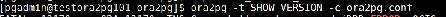

This will show the Oracle database server version. It is recommended to take some time here to test the installation as most problems take place here. After successful connection, we will see below message.

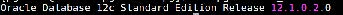

Note that you can see all options by running ora2pg -help. 

Next run the assessment report.

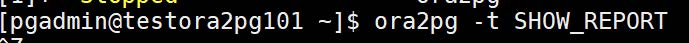

If you want to generate output in html format use “dump_as_html”.
Ora2pg -t SHOW_REPORT --dump_as_html
Ora2pg -t SHOW_REPORT --dump_as_html > $HOME/report.html
To estimate the migration cost in man days, use ESTIMATE_COST switch in Ora2pg.
Ora2pg -t SHOW_REPORT –estimate_cost
Ora2pg -t SHOW_REPORT --dump_as_html –estimate_cost > $HOME/report.html
In order to export schema run Ora2pg command. Output file will be stored in /var/tmp directory.
Ora2pg -c /etc/ora2pg/ora2pg.conf
Ora2pg -t SHOW_SCHEMA will display oracle schema to export in the ora2pg.conf file

Ora2pg -c /etc/ora2pg.conf -t SHOW_SCHEMA
Export data of an individual table. (update the conf file)
Ora2pg -d -c /etc/ora2pg.conf -b /datadrive/newexport/ --dump_as_csv
Load into PostgreSQL.
psql -h sirvalhyper-small-c.postgres.database.azure.com -d citus -U citus -f PARAMETERVALUES_output.sql
Load data into PostgeSQL. It's most important that you first create a psql database and user for the import.
Ora2pg -c /etc/ora2pg.conf -t INSERT -o /datadrive/table1_data.sql -b data/

## Next steps
[Continue >](../module07/optional.md)

## Skip to Home
**[Home](../../README.md)**

