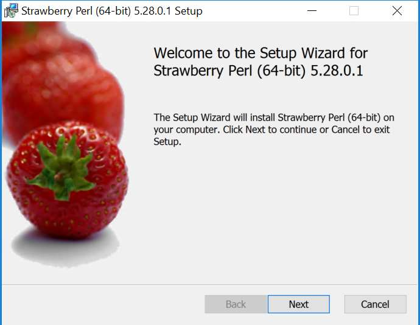

[< Previous Module](../module06/Ora2PG.md) - **[Home](../../README.md)** - [Next Module >](../module06/Ora2PGInstallLinux.md)

## Module06a - Ora2PG Installation on Windows

This document is meant to be used as a Quick Installation Guide for enabling
migration of schema & data from Oracle to Azure Database for PostgreSQL using
ora2pg tool. Complete details on the tool can be found at
http://ora2pg.darold.net/documentation.html

## Pre-Requisites

The following software must be installed in the Windows machine prior to installing ora2pg:
 Perl 5.10 or more
 Oracle Instant Client or Full Oracle installation
 [optional] Visual C++ or Visual Studio Express
 DBD::Oracle Perl Module
 ora2pg

It is recommended that you use the order above to proceed with the installation.
Note that the version of Windows used for this exercise is a Windows Server 2016

## Installing Perl 5.10 or more

1) go to http://strawberryperl.com/ and download the latest version of Perl – as of now 5.28 is the
latest version
2) Double click on strawberry-perl-5.28.0.1-64bit

3) Run the wizard until the end of installation:

4) Verify that Perl was installed successfully:
cmd> perl --version

## Installing Oracle Instant Client or Full Oracle Installation

1) Go to https://www.oracle.com/technetwork/database/enterprise-edition/downloads/index.html and
download either the oracle client or a full Oracle Installation

For this exercise a full Oracle Database software will be installed
2) Extract the Oracle file winx64_12201_database.zip to any location

3) Navigate to the extracted folder “winx64_12201_database” -> database and double click on setup
to install the Oracle database

4) Run the wizard until it finishes and wait for the Oracle product to be installed

## Installing DBD::Oracle Perl Module

1) Go to https://metacpan.org/pod/DBD::Oracle and click on “Download”
The file DBD-Oracle-1.76.tar.gz will be downloaded

2) Extract the file to the C:\ drive – use winzip or winrar or any other “untar” tool available in the
machine

3) Open a Command Prompt (cmd) and navigate to the C:\DBD-Oracle-1.76
cd c:\DBD-Oracle-1.76\DBD-Oracle-1.76\

4) Set your ORACLE_HOME to the Instant Client directory
set ORACLE_HOME=C:\app\corp\virtual\product\12.2.0\dbhome_1

5) Set your NLS parameter as below
set NLS_LANG=.WE8ISO8859P15

6) Once the NLS and ORACLE_HOME parameters are set, run the following:
perl Makefile.PL

[optional]
The next step is to run nmake install. Visual Studio Express or Visual C++ Express is needed on
the Windows Server, so nmake is a command enabled in the windows server.
https://social.technet.microsoft.com/wiki/contents/articles/50941.visual-studio-express-2017-
offline-installer-win7-install-instructions.aspx?Redirected=true
Complete the installation of Visual Studio Express in order to enable nmake.

[optional]
"C:\Program Files (x86)\Microsoft Visual
Studio\2017\WDExpress\VC\Tools\MSVC\14.16.27023\bin\Hostx86\x86\nmake.exe" install

At this point you are all set.

## Installing ora2pg
1) Go to https://sourceforge.net/projects/ora2pg/ to download ora2pg
2) Go to ora2pg installation folder
cd ora2pg-19.1
3) Type perl Makefile.PL

4) Set the environment variables: ORACLE_HOME and LD_LIBRARY_PATH
ORACLE_HOME=<Oracle client software location>
LD_LIBRARY_PATH=<Oracle client software location>/lib
In this install:
set ORACLE_HOME=C:\app\corp\virtual\product\12.2.0\dbhome_1
set LD_LIBRARY_PATH=C:\app\corp\virtual\product\12.2.0\dbhome_1\lib

5) gmake && gmake install

ora2pg is set.
## Testing ora2pg installation

Type ora2pg –version as following:

 
  
## Next Module
[Continue >](../module06/Ora2PGInstallLinux.md)

